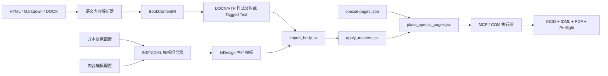

# 证据驱动的 InDesign 图书模板编译系统设计

日期：2026-08-17  
状态：待用户书面复核  
范围：标准32开、大32开、标准16开；其他开本不进入第一版

## 1. 目标

建立一套低 Token、可复用、可追溯的图书排版系统。系统不让模型逐页决定坐标，而是先收集合法 InDesign 原件、正式出版物截图和官方规范，再把验证后的规则固化为模板、数据契约和固定脚本。

第一版只解决：

1. HTML/Markdown/Word 内容进入 InDesign 正文主文本流；
2. 正文母版、页眉、页脚、页码和自动分页；
3. 封面、目录、章首页等特殊页面的高分辨率图片置入；
4. 三种开本族下的模板组合；
5. INDD、IDML、单页 PDF 和预检报告输出。

第一版不处理复杂脚注系统、索引、公式、异形跨页、复杂表格和高度自由的图文杂志版式。

## 2. 不可绕过的证据门禁

任何模板在进入生产前，必须同时绑定：

1. 至少一份来源合法的 `INDD`、`IDML` 或 `INDT` 生产原件；
2. 至少两本中国正式出版图书的对应页面截图；
3. 至少一份 Adobe 原生功能依据；
4. 至少一份开本、出血、文件或印刷规范依据；
5. 一份字段级借鉴记录，明确可借鉴项、不可复制项和重新参数化方式。

缺少任一项时，模板状态只能是 `candidate`，编译器拒绝生产调用。视觉参考不得用于一比一复制；原件只用于分析页面尺寸、母版、样式、主文本框、对象结构、导出预设和预检配置。

## 3. 已获得的首份生产原件

来源：Lulu 官方 Guides & Templates。  
原始 ZIP：`research/reference-originals/lulu-book-template-all-a5.zip`  
SHA-256：`B604553285B3C811350F34D499377D63E74B9ACFBBD7524FFA4D5871F304A243`

包内已经确认包含：

- A5 内页单页和跨页 `INDD + IDML`；
- 平装、精装、护封、骑马订、线圈封面 `INDD + IDML`；
- 对应 PDF、PNG、PSD；
- 内页和封面 PDF 导出 `.joboptions`；
- 官方 Book Creation Guide。

已解析的单页 IDML 为 148 × 210 mm、打印意图、四边约 3.175 mm 出血。该文件只作为 A5/国际32开附近尺寸的生产结构参考，不直接冒充中国标准32开或大32开。

## 4. 开本模型

第一版只保留三个开本族：

- `TRIM-32K-STANDARD`：标准32开；
- `TRIM-32K-LARGE`：大32开；
- `TRIM-16K-STANDARD`：标准16开。

“32开”“大32开”“16开”不能作为唯一尺寸依据。每个可执行配置必须包含精确毫米值和来源证据：

```json
{
  "trim_family": "TRIM-32K-LARGE",
  "trim_width_mm": 145,
  "trim_height_mm": 210,
  "bleed_mm": 3,
  "binding": "perfect-bound",
  "source_original": "provider-template.idml",
  "source_sha256": "...",
  "approval_status": "approved"
}
```

在国家标准或印厂原件未绑定前，记录不得写入精确尺寸，也不得进入模板编译。第一版之外的正度16开、大16开、国际32开和异型开本均不创建运行配置。

## 5. 模板矩阵

系统采用“内容模板族 × 开本配置”组合，不复制维护 21 套独立代码。

候选内容模板族：

1. 长篇小说标准型；
2. 小说疏朗型；
3. 散文诗歌型；
4. 人生叙事型；
5. 家庭图文型；
6. 书信日记型；
7. 集体纪念型。

三个开本族与七个内容族形成 21 个逻辑组合。底层只维护：

- 7 份内容样式配置；
- 3 份开本几何配置；
- 一套模板组合器；
- 三个固定 InDesign 执行脚本。

七个内容模板在完成证据采集前全部保持 `candidate`，本设计不预先认定它们已经可用。

## 6. 总体架构



MCP/COM 只负责启动 InDesign、执行脚本、读取结果和打开产物，不负责审美判断。

## 7. HTML 与 InDesign 的联合方式

HTML 不直接转换为逐坐标 JSX。解析器只读取语义标签和少量允许属性：

- `h1`：书名或一级标题；
- `h2`：章标题；
- `h3`：小节标题；
- `p`：正文；
- `blockquote`：引文；
- `aside`：注释或旁注；
- `figure/img/figcaption`：图片和图注；
- `time`：日期；
- `address`：署名或书信落款。

CSS 的像素坐标、绝对定位、网页字体回退和屏幕断点全部丢弃。解析结果进入统一 `BookContentIR`：

```json
{
  "blocks": [
    {"type": "chapter-title", "text": "第一章 车窗里的故乡"},
    {"type": "body", "text": "车开出城的时候……"},
    {"type": "quote", "text": "……"}
  ]
}
```

第一生产通道采用 DOCX/RTF 样式映射：转换器生成稳定的 Word 样式名，InDesign 原生置入时映射到模板内段落样式。Adobe 官方明确支持 Word/RTF 置入、样式冲突处理和自定义 Style Mapping。

第二生产通道采用 InDesign Tagged Text，用于需要完全确定的段落、字符和特殊字符控制。XML 保留为后续结构化出版接口，不作为第一正文导入通道，因为 InDesign XML 导入不会自动创建页面和文本框。

## 8. 模板原件的职责

`INDT/IDML` 模板只保存：

- 精确页面尺寸、出血、装订方向；
- 父页和 Primary Text Frame；
- 段落、字符、对象、表格和 TOC 样式；
- 基线网格、栏、边距和安全区；
- 页眉页脚占位符和自动页码；
- 图像框对象样式；
- PDF 导出预设和 Preflight Profile。

模板不保存具体书稿正文，不保存未经授权的参考图片，不硬编码书名和章节名。

## 9. 三个固定脚本

### 9.1 `import_body.jsx`

- 打开通过证据门禁的 INDT/IDML 模板；
- 置入 DOCX、RTF 或 Tagged Text；
- 按固定映射表使用模板内样式；
- 把正文放入 Primary Text Frame；
- 开启 Smart Text Reflow 和 Preserve Facing-Page Spreads；
- 自动增加页面；
- 检查正文 story 连续、段落数一致和 overset 为零。

### 9.2 `apply_masters.jsx`

- 按页面角色应用正文左页、正文右页、正文首页、章首页和空白页父页；
- 页眉只替换书名、章名或短标题；
- 页脚只替换自动页码和允许的固定字段；
- 章首页、空白页和全出血图片页隐藏导航；
- 章节按批准规则从右页开始并自动补空白左页。

### 9.3 `place_special_pages.jsx`

读取 `special-pages.json`：

```json
{
  "pages": [
    {"role": "cover", "mode": "full-page-image", "path": "cover-300ppi.tif"},
    {"role": "toc", "mode": "background-plus-text", "path": "toc-bg-300ppi.tif"},
    {"role": "chapter-opener", "mode": "background-plus-text", "path": "ch01-bg-300ppi.tif"}
  ]
}
```

支持两种模式：

- `full-page-image`：封面等完整页面图；
- `background-plus-text`：高分辨率无字背景＋InDesign 原生文字层。

脚本检查有效 PPI、色彩空间、出血覆盖、链接状态和安全边距。视频“补帧”不用于静态书页；低清静态图只能重新渲染、重新生成或进行明确记录的超分辨率处理。

## 10. Token 使用边界

零 Token 执行：

- 正文导入；
- 自动分页；
- 样式映射；
- 页眉页脚；
- 母版应用；
- 目录更新；
- 图片批量置入；
- 预检和导出。

允许使用模型：

- 从实书对照中选择模板族；
- 生成封面、目录或章首页无字背景；
- 处理少量异形图文页面；
- 对预检无法自动修复的问题提出建议。

## 11. 参考登记结构

每个模板族建立独立证据目录：

```text
references/templates/<template-id>/
  evidence.json
  originals/
  chinese-book-screenshots/
  official-specs/
  field-mapping.json
  review.md
```

`evidence.json` 记录来源 URL、许可、采集日期、文件哈希、页面类型和证据状态。`field-mapping.json` 只记录网格、版心、层级、导航、图片槽、留白和节奏等抽象字段。

## 12. 验证与失败策略

每个 21 逻辑组合至少验证：

- 页面毫米尺寸与证据一致；
- 页数自动增加且左右页关系不乱；
- 原文段落数和哈希保持；
- 0 overset；
- 0 missing fonts；
- 0 missing links；
- 正文、页眉、页脚和目录仍为原生文字；
- 特殊页面图片有效分辨率达到配置门槛；
- PDF 为单页输出；
- INDD 和 IDML 可重新打开；
- Preflight 无阻断错误。

任何证据、内容映射、样式映射或预检失败都必须停止生产，不自动缩小正文基础字号，不用图片替代失败的正文。

## 13. 依据

- 国家标准化管理委员会：GB/T 788-1999《图书和杂志开本及其幅面尺寸》：`https://openstd.samr.gov.cn/bzgk/std/newGbInfo?hcno=31D12097388E45D11A50662396368FEB`
- Adobe Parent Pages：`https://helpx.adobe.com/ca/indesign/using/parent-pages.html`
- Adobe Smart Text Reflow：`https://helpx.adobe.com/indesign/desktop/add-and-manage-text/add-and-import-text/set-up-smart-text-reflow.html`
- Adobe Word Style Mapping：`https://helpx.adobe.com/indesign/desktop/format-and-style-text/text-styles/map-word-styles.html`
- Adobe Tagged Text / import options：`https://helpx.adobe.com/indesign/desktop/add-and-manage-text/add-and-import-text/import-options.html`
- Adobe XML：`https://helpx.adobe.com/indesign/using/xml.html`
- Lulu 官方模板：`https://www.lulu.com/publishing-toolkit`
- BookBaby 官方模板：`https://www.bookbaby.com/book-printing/templates`
- Blurb InDesign 插件：`https://support.blurb.com/hc/en-us/articles/212771823-Blurb-Adobe-InDesign-Plug-in`
- IngramSpark File Creation Guide：`https://www.ingramspark.com/hubfs/downloads/file-creation-guide.pdf`
- 国家新闻出版署 2024“最美的书”：`https://www.nppa.gov.cn/xxfb/dfgz/202412/t20241203_876173.html`
- 中国出版传媒商报《何物》：`https://www.cbbr.com.cn/contents/533/98270.html`

## 14. 决策摘要

- 不直接把 HTML 页面截图放进正文；
- 不把 HTML CSS 坐标翻译为 InDesign 坐标；
- 采用 HTML 语义解析＋Word/RTF 样式映射为首选正文通道；
- 采用 Tagged Text 作为高确定性高级通道；
- 采用证据驱动的 INDT/IDML 模板；
- 采用 7 内容族 × 3 开本族的组合模型；
- 第一版只支持标准32开、大32开、标准16开；
- 目录、章首页优先使用无字高分辨率背景＋原生文字；
- 封面允许使用完整高分辨率页面图；
- 三个固定 JSX 脚本通过 MCP/COM 一键执行。
