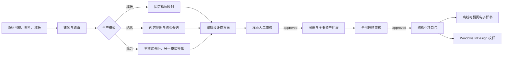

# 图书生产 Skills 套件 V1 使用说明

## 背景与目标用户

这套系统面向个人 Mac/Windows 中文图书项目维护者，解决旧 Skill 数量过多、职责冲突、素材状态不清、生成图与可编辑文字混在一起的问题。V1.2 保留跨平台前序生产链，并在 Windows 上增加 Adobe InDesign 2025 COM 校样构建。

## 解决方案

系统使用 7 个生产/展示 Skill 与 1 个治理 Skill：

| Skill | 负责 | 核心输出 |
|---|---|---|
| `book-production-router` | 建项、三模式和六类别路由 | 项目配置、素材清单、待补项 |
| `build-template-book` | 固定页数与槽位适配 | 页面计划、槽位报告 |
| `plan-memorial-book` | 长文本内容地图与目录候选 | 内容地图、2～3 套结构、目录 brief |
| `design-book-editorial` | 两套视觉方向、组件检索与全书设计系统 | 设计基因、候选案例、两阶段参考映射、页面家族 |
| `create-book-images` | 无字图像生成、版本证据与人工选图 | 受控 Prompt、生成授权、图片版本、审核与待审批提案 |
| `review-book-production` | 制作检查和两级人工门禁 | 审核报告、门禁状态 |
| `build-book-flipbook` | 将已批准页面装配为离线电子样书 | StPageFlip HTML、键盘/触摸翻页、硬封面与软内页 |
| `build-indesign-book` | Windows InDesign 校样构建 | JSX、INDD、PDF、质量报告 |
| `evolve-book-skills` | 每周知识库维护与候选升级 | 周报、归档清单、进化提案 |

## 安装到个人 Codex

在套件根目录运行：

```bash
python3 scripts/install_personal.py
```

安装器会把完整共享运行时复制到 `~/.codex/book-production-skills-v1/`，建立独立 Python 环境，并在 `~/.codex/skills/` 创建 9 个 Skill 入口。它不会覆盖同名的非本套件 Skill。

套件升级后使用：

```bash
python3 scripts/install_personal.py --replace
```

安装或更新后，从下一次 Codex 对话开始使用新 Skill。工程源目录仍是维护源，个人运行目录是实际调用副本。

完整路径和知识库分区见 `docs/Skill与知识库位置索引.md`；机器可读入口为 `~/.codex/skills/BOOK-PRODUCTION-LOCATION.json`。



## 按出版流程执行

### 1. 建项

准备书名、负责人、模式、一个主类别、辅助标签、页数条件和素材路径。素材未齐也可建项，但状态必须为 `missing/pending/unusable`，不能假装已收到。

模板书、纪念书同时存在时选择 `hybrid` 并明确 `primary_mode`。六个主类别为人生纪念、家庭纪念、书信日记、散文诗歌、成长纪念、集体纪念。

### 2. 内容与模板处理

- 模板书：按槽位映射完整原文。文字放不下时报告 `text_overflow`，不得删字或违规缩小字号。
- 纪念书：正文只读，建立人物、时间、地点、事件、主题、图片关联和缺口；根据真实材料提供 2～3 套结构，不默认时间线。

### 3. 编辑设计

先核验正式案例库，再用同一批真实项目内容制作两套视觉方向。每本书选择 5～8 个页面家族；目录单独设计；全书只用一个章首页母版；页眉页脚优先复用三个 JSON 模板。

字体只使用明确免费商用字体或用户合法获得的方正会员字体。方正字体文件不随套件分发。正文字体、字号和行距服从出版基础规则，不作为自由创意变量。

封面方向必须先检索当前 `available` 的 50 案例库，每次稳定返回 5 本不同图书，并显示真实案例图、来源、匹配字段与分数。设计者再为每个方向选择 2～3 个案例，逐条写明“借用字段、排除字段、如何转化”。系统先生成两份 draft selection，完成 schema 和 Prompt 安全预检后，向用户完整回显 selection ID 与 SHA；只有用户对准确版本二次确认，状态才可变为 `approved`。不能用“最美的书风格”或口头同意跳过这一步，也不能整体复制某个案例。

### 4. 图像

真实照片为 `documentary`，只做恢复、裁切和基础调整；无照片的记忆场景为 `memory-illustration`，必须标明非纪实；背景和装饰为 `design`。统一调用系统 `imagegen`。

关键文字保留在排版层。主索引只记录 Prompt 文件路径，完整 Prompt 独立保存。封面背景无字，书名、作者与纸船印记进入 `editable_text_overlay`。

组件图像还要执行完整证据链：approved selection → production 重编译 Prompt → 用户明确批准 Prompt、参考图、费用动作和输出位置 → `GenerationExecutionBundle` 固定无字 background 与已授权参考图字节 → 输出初始记为 `draft` → 七项检查 → 用户选择具体 image/hash/version → `selected` review。机器不能自行选图或替用户批准；认可图片最多生成项目内 `proposed/pending/accumulation` 提案，不能直接写入正式知识库。

当前交付包含可运行的封面知识库，以及正在积累的章首页知识库；没有替用户执行付费生图。两库案例图片均按 `accumulation / internal reference only` 管理，来源公开可访问不代表可商用复制、转载或再发行。章首页只有达到 `available / 50 / errors=[]` 后才可进入正式项目的 5 案例检索。

### 5. 人工审核

先审核代表性样页，再扩展全书；全书完成后再终审。门禁只有 `pending/approved/rejected`。口头同意、时间压力和微小正文哈希差异都不能绕过门禁。

### 6. 每周维护

每周运行维护脚本。认可图片可进入知识库；过期和负面案例只归档。候选 Skill 至少 15 个同组案例、相对提升 10%、零单例回归并具备回滚路径，指标通过后仍需人工批准。

## 人工确认点

1. 混合模式的主模式与主类别。
2. 纪念书结构和目录标题。
3. 两套样页中的最终视觉方向。
4. 生成图片的选中版本与真实性标注。
5. 样页审核和全书终审。
6. Skill 版本升级与回滚路径。

### 7. 电子样书展示

页面系统确认后可调用 `build-book-flipbook`。每个物理页保留为真实 HTML，使用本地固定版本的 StPageFlip 提供硬封面、软内页、桌面双页、移动单页、目录跳转和键盘翻页。展示阶段不重新排版、不改正文、不依赖 CDN，也不等于交互式 Agent 前端。

### 8. InDesign 校样构建

最终页序和物理单页批准后，Windows 可调用 `build-indesign-book`。执行器使用 `InDesign.Application.2025` COM 和仓库内生成的 JSX，不依赖 pywin32 或鼠标坐标。`proof` 模式输出 INDD、单页 PDF 和质量报告；输入低于 300 PPI、没有真实出血或只是扁平图像时，报告必须保持 `print_ready=false`。`print` 模式不得绕过这些阻断项。

## V1 边界

V1.2 不做文字校对、不修改内容、不生产版权页，也不包含交互式 Agent 前端。它可把已批准页面装配为离线 HTML 电子样书，并在 Windows 输出 InDesign/PDF 校样；只有可编辑排版、300 PPI、出血、色彩和印厂参数全部完成后才能称为印刷文件。当前封面和章首页组件库均为 `available / 50`；目录和插画装饰库仍为 `planned`。原始素材始终只读。

## 验收标准

- JSON 均通过对应 schema。
- 原文 SHA-256 前后一致。
- 目录、正文、章首页、页眉页脚均为可编辑文字。
- 每个设计部件至少 10 个确认案例；借鉴项与变化项有记录。
- 两级人工门禁均正式批准后才能完成。
- 运行 `python scripts/validate_all.py` 全部通过。

## 样例

`examples/four-seasons-letters/` 使用旧套件中已存在的真实书名“四时来信”和章节名“春归”。旧样例没有正文段落，因此样例明确标记待确认，没有补造正文。
